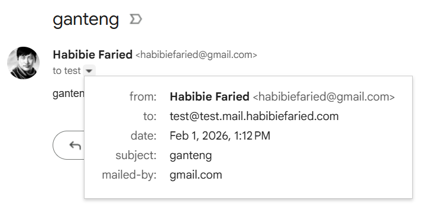
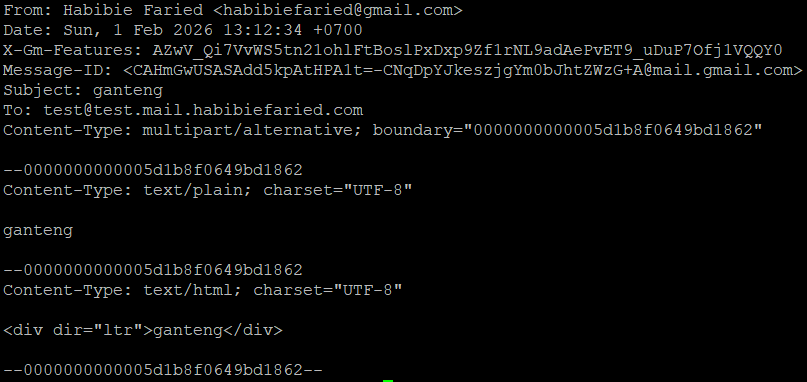

## Live Testing & Screenshots

Below are real-world screenshots and explanations of the server in action:

### 1. Setup & Receiving Email


- The server is started with the `MAIL_SERVERS` environment variable.
- It prints a table for each FQDN and IP pair, showing the status of A, MX, and PTR records.
- If any record is missing or incorrect, the server will not start and will print a clear error.

### 2.1. Sending an Email from Gmail



- An email is sent from Gmail to the server's configured address.

### 2.2. Email Received and Saved



- The server receives the email and saves it to a file in the `emails/` directory.
- The filename is a timestamp in nanoseconds, ensuring uniqueness.
- The server logs a summary: `from: <sender>, saved in <filename>`
- No email content is printed to the console for privacy and clarity.

# Email Server

A simple SMTP server in Go using the `go-smtp` library.

## Features
- Accepts SMTP connections on port 25
- Logs sender, recipient, and email body to console
- Prints required DNS records for mail delivery
- Does NOT store or forward emails (for testing/learning only)

## Quick Start

### 1. Build
```sh
make build
```


### 2. Run (Requires root/Administrator)
```sh
# Linux/Mac
sudo MAIL_SERVERS="mail1.example.com,1.2.3.4:mail2.example.com,5.6.7.8" ./email-server.exe

# Windows (run as Administrator)
$env:MAIL_SERVERS="mail1.example.com,1.2.3.4:mail2.example.com,5.6.7.8"; .\email-server.exe
```

### 3. DNS Records
The server prints a table of required DNS records (A, MX, PTR) and their status. PTR is optional but recommended.


## Environment Variables
| Variable      | Required | Description                                                      |
|---------------|----------|------------------------------------------------------------------|
| MAIL_SERVERS  | Yes      | List of FQDN,IP pairs separated by `:` (see example above)        |

## Project Structure
- `cmd/email-server/main.go` — Entry point
- `internal/server/` — SMTP backend/session/server logic
- `internal/dnsutil/` — DNS validation and checking

## Clean Up
To remove the binary:
```sh
make clean
```

**Testing your PTR record:**
```bash
nslookup -type=PTR 1.2.3.4
# or
dig -x 1.2.3.4
```


Should return: your FQDN (e.g., `mail1.example.com`)

**Why it matters:** Many mail servers check PTR records to verify sender legitimacy. Without proper PTR records, your emails are more likely to be marked as spam.
