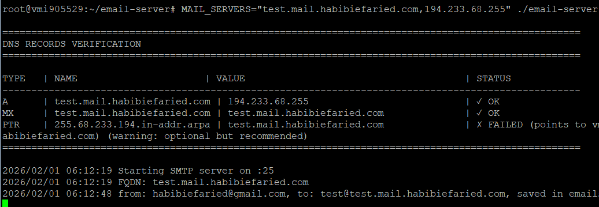

# Email Server

[](https://github.com/habibiefaried/email-server/actions/workflows/ci.yml)

A simple SMTP server in Go using the `go-smtp` library.

## Features
- Accepts SMTP connections on port 25
- Logs sender, recipient, and email body to console
- Prints required DNS records for mail delivery
- Stores emails to disk (file storage)
- Stores emails to PostgreSQL database with attachment tracking
- Dual-write capability (file + database simultaneously)
- HTTP API for fetching emails with pagination support
- Fully tested with automated CI/CD pipeline
- Does NOT forward emails (for testing/learning only)

## Quick Start

### 1. Build
```sh
make build
```

### 2. Run (No root required by default)
```sh
# Linux/Mac - uses default port 2525 (no sudo needed)
MAIL_SERVERS="mail1.example.com,1.2.3.4:mail2.example.com,5.6.7.8" ./email-server.exe

# Or use port 25 (requires sudo)
sudo SMTP_PORT=25 MAIL_SERVERS="mail1.example.com,1.2.3.4" ./email-server

# Windows (no administrator required by default)
$env:MAIL_SERVERS="mail1.example.com,1.2.3.4:mail2.example.com,5.6.7.8"; .\email-server.exe
```

### 3. DNS Records
The server prints a table of required DNS records (A, MX, PTR) and their status. PTR is optional but recommended.


## Environment Variables
| Variable      | Required | Description                                                      |
|---------------|----------|------------------------------------------------------------------|
| MAIL_SERVERS  | No       | (Optional) List of FQDN,IP pairs separated by `:` (see example above). If not set the program will print `Email server is running` and expose a simple HTTP health endpoint at `/`.       |
| SMTP_PORT     | No       | (Optional) SMTP server port. Defaults to `2525` if not set. Use port `25` for production or when running as root.       |
| HTTP_PORT     | No       | (Optional) HTTP health port. Defaults to `48080` if not set.      |
| DB_URL        | No       | (Optional) PostgreSQL connection string (works with Neon, AWS RDS, or any PostgreSQL). If provided, emails are saved to both file and database. Format: `user=username password=pass dbname=emaildb host=hostname port=5432 sslmode=require`       |

**Note:** For Neon PostgreSQL, always use `sslmode=require`. For local PostgreSQL, you can use `sslmode=disable`.

## Project Structure
- `cmd/email-server/main.go` — Entry point
- `internal/server/` — SMTP backend/session/server logic
- `internal/dnsutil/` — DNS validation and checking

## Clean Up
To remove the binary:
```sh
make clean
```

**Testing your PTR record:**
```bash
nslookup -type=PTR 1.2.3.4
# or
dig -x 1.2.3.4
```


Should return: your FQDN (e.g., `mail1.example.com`)

**Why it matters:** Many mail servers check PTR records to verify sender legitimacy. Without proper PTR records, your emails are more likely to be marked as spam.

## Live Testing & Screenshots

## HTTP API Endpoints

The server exposes HTTP endpoints on `HTTP_PORT` (default `48080`):

### Health Check
- **Endpoint:** `GET /`
- **Description:** Returns server health status
- **Response:** Plain text `OK`
- **Example:**
  ```bash
  curl http://localhost:48080/
  ```

### Inbox API
- **Endpoint:** `GET /inbox?name=<email_address>&limit=<n>&offset=<n>`
- **Description:** Fetch emails for a specific recipient address from PostgreSQL
- **Query Parameters:**
  - `name` (required) — Email address to filter by
  - `limit` (optional) — Number of emails to return (default: 100, max: 1000)
  - `offset` (optional) — Number of emails to skip (default: 0)
- **Response:** JSON array of email objects with attachments metadata
- **CORS:** Enabled for cross-origin requests (React/frontend integration)
- **Requires:** PostgreSQL storage must be configured (`DB_URL` environment variable)
- **Examples:**
  ```bash
  # Get first 100 emails (default)
  curl http://localhost:48080/inbox?name=test@example.com
  
  # Get first 20 emails
  curl http://localhost:48080/inbox?name=test@example.com&limit=20
  
  # Get next 20 emails (pagination)
  curl http://localhost:48080/inbox?name=test@example.com&limit=20&offset=20
  ```
- **Response Format:**
  ```json
  [
    {
      "id": 1,
      "from": "sender@example.com",
      "to": "test@example.com",
      "subject": "Test Email",
      "date": "Wed, 5 Feb 2026 10:30:00 +0000",
      "body": "Email body content (HTML-ready)",
      "created_at": "2026-02-06T08:30:00Z",
      "attachments": [
        {
          "id": 1,
          "filename": "document.pdf",
          "content_type": "application/pdf",
          "size": 52480
        }
      ]
    }
  ]
  ```

**Note:** The API supports pagination through `limit` and `offset` parameters. By default, it returns the latest 100 emails for the specified address, ordered by creation time (newest first). Maximum limit is 1000 emails per request. The `body` field contains the parsed email body ready for HTML rendering in React.js or other frontends.


Below are real-world screenshots and explanations of the server in action:

### 1. Setup & Receiving Email


- The server is started with the `MAIL_SERVERS` environment variable.
- It prints a table for each FQDN and IP pair, showing the status of A, MX, and PTR records.
- If any record is missing or incorrect, the server will not start and will print a clear error.

### 2.1. Sending an Email from Gmail


- An email is sent from Gmail to the server's configured address.

### 2.2. Email Received and Saved




- The server receives the email and saves it to a file in the `emails/` directory.
- The filename is a timestamp in nanoseconds, ensuring uniqueness.
- The server logs a summary: `from: <sender>, saved in <filename>`
- No email content is printed to the console for privacy and clarity.

## Docker Deployment

### Prerequisites

Create a `.env` file for your environment variables (keeps sensitive data out of git):

```bash
# Copy the example file
cp .env.example .env

# Edit with your configuration
nano .env  # or use your preferred editor
```

Example `.env` file for Neon PostgreSQL:
```bash
# SMTP Configuration
MAIL_SERVERS=mail.example.com,1.2.3.4
SMTP_PORT=2525
HTTP_PORT=48080

# Neon PostgreSQL Connection
DB_URL=user=myuser password=mypassword dbname=mydb host=ep-something.us-east-1.aws.neon.tech port=5432 sslmode=require
```

**Important:** Add `.env` to your `.gitignore` to avoid committing credentials.

### Build and Run with Docker Compose

```bash
# Clone or download the repository
cd email-server

# Create your .env file (see above)
cp .env.example .env
# Edit .env with your Neon credentials

# Build and start the service
docker-compose up -d

# View logs
docker-compose logs -f email-server

# Stop the service
docker-compose down
```

### Docker Build Notes (gcc/cgo)

The Docker build is configured with `CGO_ENABLED=0`, so it does not require a C compiler. If you previously saw `C compiler "gcc" not found`, rebuild with the latest Dockerfile:

```bash
docker-compose build --no-cache
docker-compose up -d
```

### Manual Docker Build

```bash
# Build the image
docker build -t email-server .

# Run with environment variables (option 1: inline)
docker run -p 25:2525 -p 48080:48080 \
  -e SMTP_PORT=2525 \
  -e DB_URL="user=myuser password=mypass dbname=mydb host=ep-something.us-east-1.aws.neon.tech port=5432 sslmode=require" \
  -e MAIL_SERVERS="mail.example.com,1.2.3.4" \
  email-server

# Run with .env file (option 2: recommended for security)
docker run -p 25:2525 -p 48080:48080 \
  --env-file .env \
  email-server
```

## Database Schema

When `DB_URL` is provided, the server automatically creates two tables:

### email table
Stores email metadata and content:
- `id` (SERIAL PRIMARY KEY) — Unique email ID
- `from` (TEXT) — Sender email address
- `to` (TEXT) — Recipient email address  
- `subject` (TEXT) — Email subject
- `date` (TEXT) — Email send date
- `body` (TEXT) — Parsed email body
- `raw_content` (TEXT) — Full raw email content
- `created_at` (TIMESTAMP) — Record creation time

### attachment table
Stores email attachments:
- `id` (SERIAL PRIMARY KEY) — Unique attachment ID
- `email_id` (INTEGER FK) — Foreign key to email table
- `filename` (TEXT) — Original filename
- `content_type` (TEXT) — MIME type (e.g., image/png)
- `data` (BYTEA) — Binary attachment data
- `created_at` (TIMESTAMP) — Record creation time

## Storage Options

### File Storage (Default)
Emails are saved to `emails/<to>/<from>/timestamp.txt`. This is always enabled.

### PostgreSQL Storage (Optional)
When `DB_URL` is set, emails are saved to PostgreSQL in addition to files.

### Composite Storage
If `DB_URL` is provided, both file and database storage are used simultaneously. If PostgreSQL connection fails, the server falls back to file-only storage with a warning.

## CI/CD Pipeline

The project includes a comprehensive GitHub Actions workflow that automatically runs on every push and pull request. The CI pipeline:
#### Key Features:
- **Default SMTP Port:** 2525 (no root required, development-friendly)
- **Port Mapping:** In Docker, maps `25:2525` (external:internal)
- **Custom Ports:** Use `SMTP_PORT` environment variable to override default
- **Production Ready:** Set `SMTP_PORT=25` with root privileges for standard SMTP port

#### How it works:
```bash
# Use default port 25 (requires sudo/root)
./email-server

# Use custom port for non-privileged environments (CI, Docker, dev)
SMTP_PORT=2525 ./email-server

# Docker automatically uses port 25 (runs as root inside container)
docker run -e SMTP_PORT=25 email-server
```
### Automated Tests
1. **Unit Tests** - Runs all Go unit tests with race detection and coverage reporting
2. **Integration Tests** - Full end-to-end testing with PostgreSQL
3. **API Testing** - Comprehensive curl-based tests including:

#### Test Coverage:
- ✅ Health check endpoint validation
- ✅ Valid email addresses with data
- ✅ Non-existent addresses (empty results)
- ✅ Missing required parameters (400 error)
- ✅ Pagination with limit parameter
- ✅ Pagination with offset parameter
- ✅ Invalid/malformed parameters
- ✅ Negative offsets handling
- ✅ Excessive limit values
- ✅ Attachment metadata validation
- ✅ Empty email addresses
- ✅ CORS headers verification
- ✅ Custom generated emails (5 unique scenarios)
- ✅ Special characters and Unicode handling
- ✅ Long content storage and retrieval
- ✅ Multi-recipient email isolation

### Test Data
The CI pipeline automatically:
1. Starts PostgreSQL service
2. Loads sample emails via SMTP (gmail.txt, anonymousemail.txt, attachments.txt)
3. Generates 5 custom test emails with dynamic content:
   - Simple text email
   - HTML content email
   - Special characters (Unicode, emojis)
   - Different recipients for isolation testing
   - Long content (50+ lines) for stress testing
4. Verifies data integrity and API responses
5. Tests edge cases and error scenarios

### Running Tests Locally
```bash
# Run unit tests
go test ./... -v -race

# Run with coverage
go test ./... -coverprofile=coverage.out
go tool cover -html=coverage.out

# Generate and send test emails (requires swaks)
# Install swaks: brew install swaks (macOS) or apt-get install swaks (Linux)
./scripts/test-emails.sh localhost 25

# Then verify via API
curl "http://localhost:48080/inbox?name=testuser@example.com" | jq
```

### Continuous Integration
Every commit is automatically tested against:
- Go 1.25.7
- PostgreSQL 16 Alpine
- Ubuntu Latest runner
- Multiple edge cases and error scenarios

The pipeline ensures code quality and prevents regressions before merging.